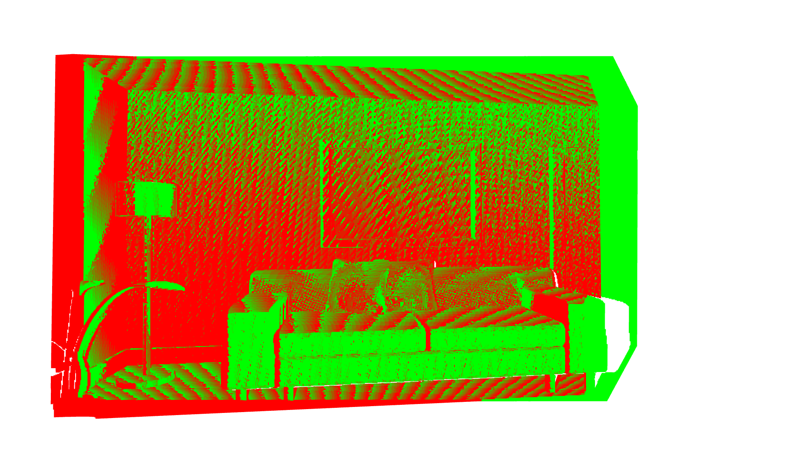

# Dense SLAM with Point-based Fusion

This is the homework in CMU 16833-Robot Localization and Mapping. A 3D dense SLAM system using point-based fusion is implemented, which is a simplified version of [1]. There are mainly three steps:

1. **Localization**: Point-to-Plane ICP using Projective Data Association (PDA), a common implementation of visual odometry that is similar to [2]
2. **Mapping**: Point-based fusion, a simplified map fusion algorithm.
3. **SLAM**: Using the Frame-to-Model ICP to estimate the transformation between image frames and create 3D dense map using the point-based fusion.

## ICP

The Iterative Closest Point (ICP) algorithm that uses the point-to-plane error metric has been shown to converge much faster than one that uses the point-to-point error metric. At each iteration of the ICP algorithm, the change of relative pose that gives the minimal point-to-plane error is usually solved using standard nonlinear least-squares methods, which are often very slow. Fortunately, when the relative orientation between the two input surfaces is small, we can approximate the nonlinear optimization problem with a linear least-squares one that can be solved more efficiently.

A useful tutorial on how to derive the linear system of point-to-plane ICP can be found at [Linear Least-Squares Optimization for Point-to-Plane ICP Surface Registration](https://www.cs.unc.edu/techreports/04-004.pdf).

The point cloud registration of two frames before ICP:

The point cloud registration of two frames after ICP:

## Point-based Fusion

KinectFusion uses volumetric TSDF as the map representation, which is non-trivial to implement. Point-based fusion, on the otherhand, maintains a weighted point cloud and actively merges incoming points, hence is easy to implement. The details can be found in [1].

The essential operations of point-based fusion are very similar to projective data association. Given an estimated pose, we first project the point `p` in the map to the image and obtain its corresponding `(u, v)` coordinates. Then, after proper filtering, we compute a weighted average of the properties (positions, normals, colors).

With the ground truth camera poses, the fusion result is:

For the 3D dense SLAM problem, we cannot get the ground truth poses of each frame. Therefore, we have to use the ICP to estimate the transformation between the world/map and the current image frame. With the poses estimated by the frame-to-model ICP, the fusion result is:

We can observe there is a little drift in the fusion map. To  reduce the drift, we can remove the outliers that remain in the unstable state for a long time. The result after reducing drift with poses estimated by frame-to-model ICP is:

The estimated trajectory with the ground truth trajectory is:

## Academic Integrity Policy

Students at Carnegie Mellon are expected to produce their own original academic work. Please think carefully when you are using the codes and do not violate academic integrity policy.

## References

[1] [Real-time 3D reconstruction in dynamic scenes using point-based fusion](http://ieeexplore.ieee.org/document/6599048/)

[2] [KinectFusion: Real-time dense surface mapping and tracking](http://ieeexplore.ieee.org/document/6162880/)

